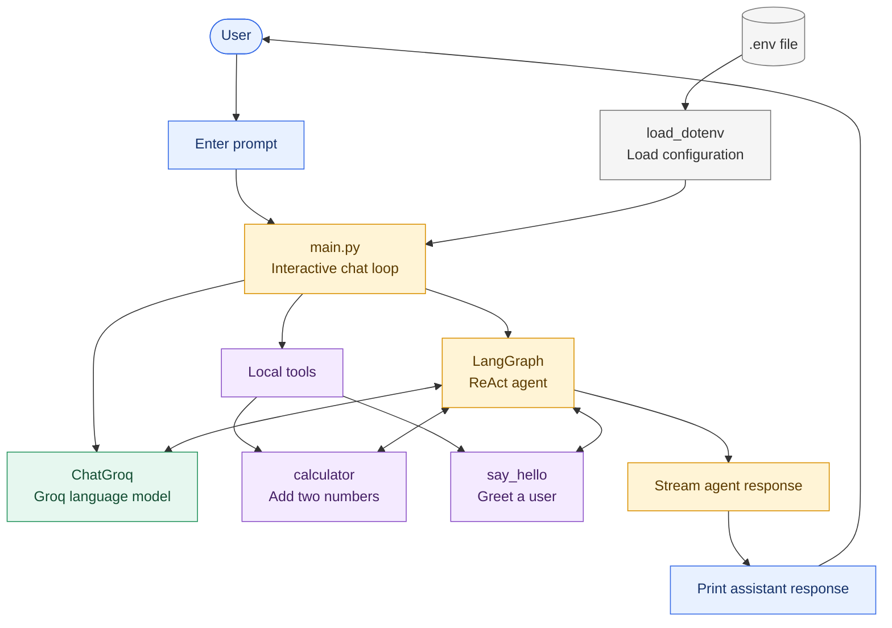

# Python AI Chatbot

A command-line AI assistant built with LangChain, LangGraph, and Groq. The assistant can answer user prompts, perform basic addition through a calculator tool, and greet users through a greeting tool.

## Features

- Interactive command-line chat loop
- Groq-hosted language model through `ChatGroq`
- ReAct agent orchestration through LangGraph
- Calculator tool for adding two numbers
- Greeting tool for responding to a name
- Environment-based configuration using a local `.env` file

## Project Structure

```text
project/
|-- main.py          # Application entry point, tools, agent, and chat loop
|-- requirements.txt # Python dependencies
|-- .env             # Local secrets and optional configuration; do not commit
|-- .gitignore       # Files excluded from version control
|-- .venv/           # Local virtual environment; created during setup
|-- README.md        # Project documentation
```

## Architecture

The application follows this workflow:



### Components

1. `load_dotenv()` loads configuration from `.env` into the process environment.
2. `main()` reads `GROQ_API_KEY` and the optional `GROQ_MODEL` setting.
3. `ChatGroq` connects the application to the Groq language model.
4. `create_react_agent()` builds an agent that can decide when to call the available tools.
5. The interactive loop sends each user message to the agent and prints streamed responses.
6. Enter `quit` to stop the application.

## Requirements

- Windows, macOS, or Linux
- Python 3.10 or newer
- A Groq API key
- Internet access when installing dependencies and calling the Groq API

## Setup With `.venv` on Windows

Open PowerShell in the project directory and run:

```powershell
# Create a virtual environment
python -m venv .venv

# Activate it for the current PowerShell session
.\.venv\Scripts\Activate.ps1

# Upgrade pip and install project dependencies
python -m pip install --upgrade pip
python -m pip install -r requirements.txt
```

If PowerShell blocks activation scripts, activate the environment from Command Prompt instead:

```bat
.venv\Scripts\activate.bat
```

You can also run the project without activating the environment:

```powershell
.\.venv\Scripts\python.exe main.py
```

## Configuration

Create or update a `.env` file in the project root:

```dotenv
GROQ_API_KEY=your_groq_api_key_here
GROQ_MODEL=qwen/qwen3.6-27b
```

`GROQ_API_KEY` is required for model requests. `GROQ_MODEL` is optional; if it is omitted, the application uses `qwen/qwen3.6-27b`.

Do not commit `.env` or expose the API key. The project `.gitignore` already excludes local environment files.

## Start the Application

With `.venv` activated, run:

```powershell
python main.py
```

Then type a message at the `You:` prompt. Examples:

```text
Add 12 and 30
Say hello to Anu
What can you help me with?
```

Type `quit` to exit.

## Deactivate the Virtual Environment

When you are finished, run:

```powershell
deactivate
```

## Troubleshooting

- If `python` is not recognized, install Python and enable the option to add it to `PATH`.
- If imports are unresolved, confirm that `.venv` is activated and run `python -m pip install -r requirements.txt` again.
- If the application reports that `GROQ_API_KEY` is not set, check that `.env` is in the same directory as `main.py` and that the variable name is spelled correctly.
- If the model name is unavailable for your Groq account, set `GROQ_MODEL` in `.env` to a supported Groq model.
